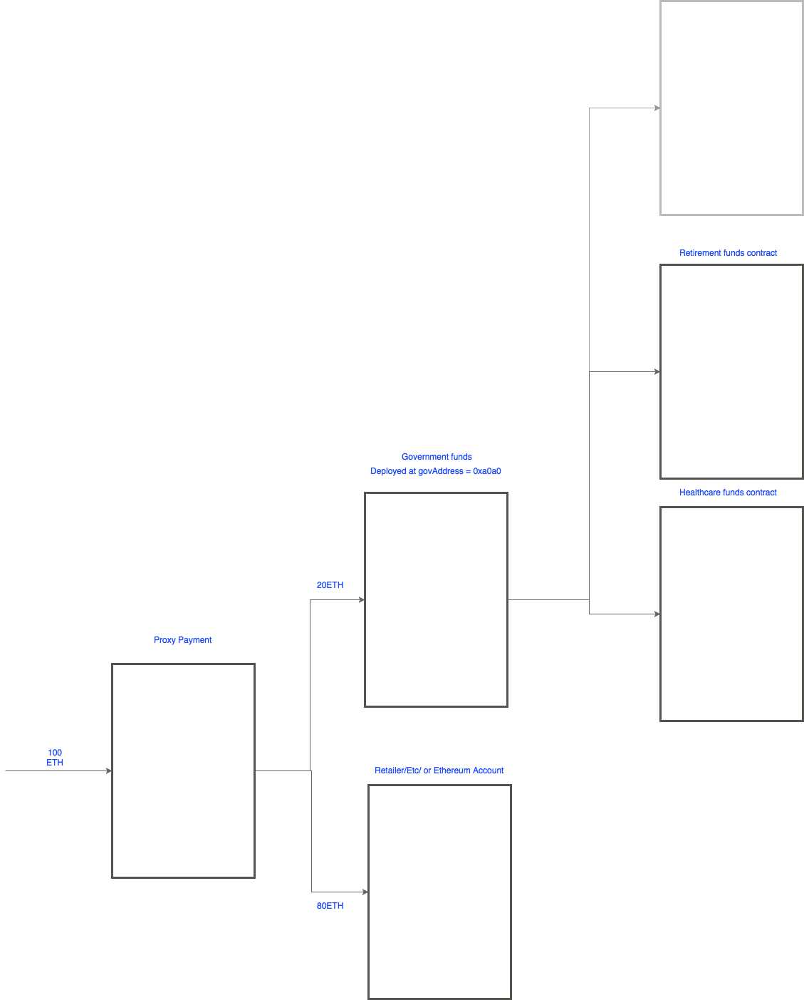

# govsolidity
implementation of some ideas in solidity

## some schemas

## automatic VAT withdrawal contract

in `Proxyfier.sol`

## Some questions

- why tx variable `tx.nonce` doesn't exist in solidity? could be interesting for LE
